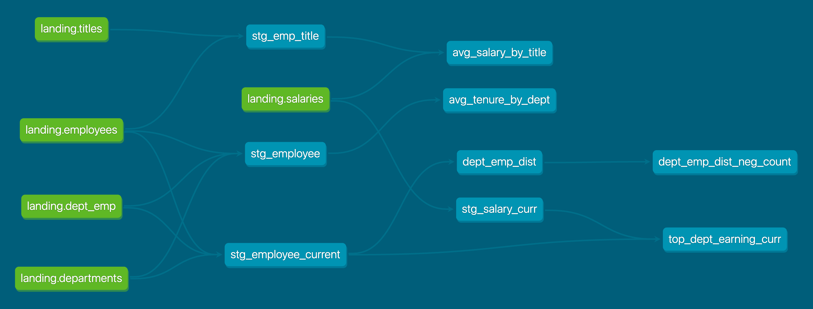

# DBT MySQL - Employee

This project utilizes MySQL server and DBT for data modeling purposes. It builds upon an existing employee database in MySQL, creating staging and data mart databases, and implementing data models within these layers. Both MySQL server and DBT server are containerized using Docker, and a docker-compose file is provided to set up both containers.

## Prerequisites

Before you begin, ensure you have Docker installed on your system.

## Getting Started

To get started with the project, follow these steps:

1. Clone this repository to your local machine.
2. Navigate to the project directory.
3. Run the following command to start MySQL server and DBT server containers:
    ```bash
    docker compose up
    ```
4. Once the containers are up and running:
   - To view DBT documentation, go to [http://localhost:8080](http://localhost:8080) in your web browser.
   - To connect to the MySQL database using external tools like Tableau, use the following credentials:
     - Host: localhost
     - Port: 3306
     - Username: root
     - Password: password

## Project Structure

- `compose.yml`: Contains configuration for running MySQL server and DBT server containers.
- `mysql_employee/tests/`: SQL containing Data Quality checks.
- `mysql_employee/macros/`: SQL script to create the data mart database.
- `mysql_employee/models/`: Directory containing DBT data models.
- `mysql_employee/dbt_project.yml`: Configuration file for DBT project.

## DBT Lineage

Below is the DBT lineage image:



## Contributing

Pull requests are welcome. For major changes, please open an issue first to discuss what you would like to change.


